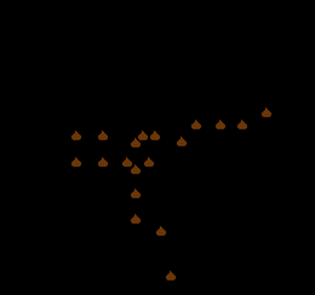

# POOPING SNAKE

Author: Yifei Sun

Design: Instead of eating, the snake poops

Screen Shot:

How Your Asset Pipeline Works:

First draw the assets, then put the asset in the correct directory. Write functions to parse the loaded vectors that contains
the pixels, and put them into sprites.

How To Play:

press space to poop, 20 poops win.

This game was built with [NEST](NEST.md).

